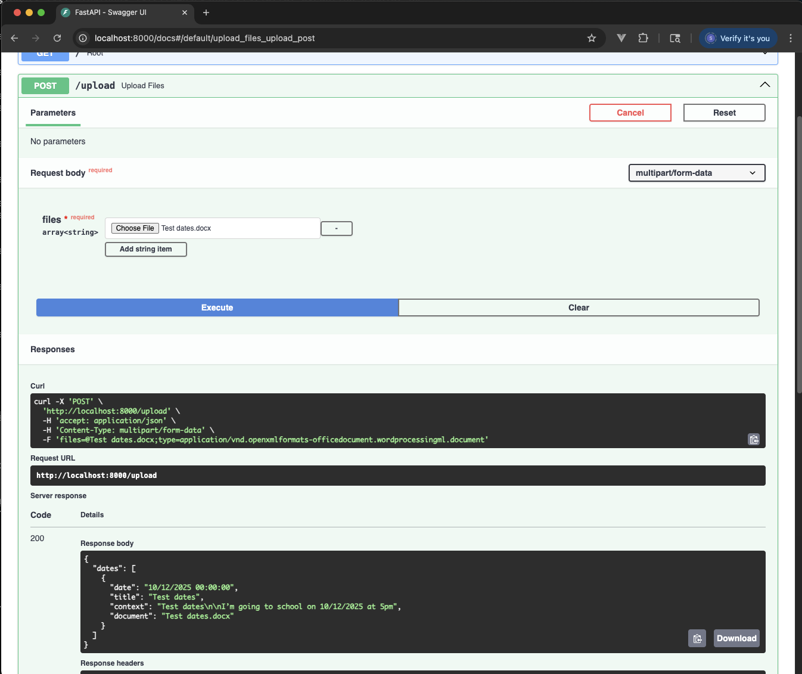
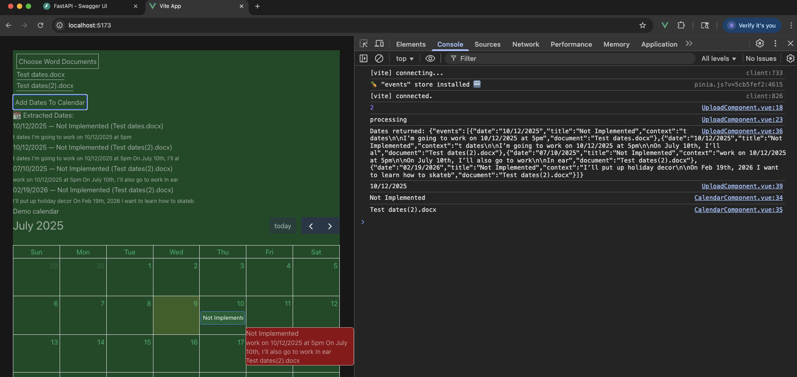

# Notes
Just keeping track of stuff I might want to discuss during the presentation

## Wow FastAPI sure is fast
Perhaps a very obvious conclusion but I was delighted to find that I could run my FastAPI server from the command line immediately without much setup (though I will note that hot-reloading is a lot slower than similar JS tech)

## Poetry? Sure why not
Last time I worked in Python was 6 or 7 years ago in school where the extent of it was running a dead simple sythesizer that we just ran from the command line, so my first step when getting started was googling "package.json but for python". Came across several and Poetry is just the one that jumped out immediately so it's the one I went with. In hindsight (20 minutes later) it maybe feels a bit heavy but Id' rather have too many features than too few.

## FastAPI Swagger view is SICK WHAT?!?!
Initially tried to test my upload function with Postman and was like "ugh okay wait so I defined the input for this endpoint to be a List of UploadFile from FastAPI, so the body should be..." and then sumbled across the /docs endpoint. This thing rocks, auto-detecting the possible return types and errors is so cool, just wish it had a dark mode (╥﹏╥)

## Most functionality implemented, not very pretty though
Basic functionality of extracting dates and adding them to the calendar widget wasn't too hard. At this point, I was solely focused on functionality, only providing the rougest styling to the UI so that I could test things out, and my date parsing is still incredibly naive, but I have an idea to make it more robust if I get the time. For now, I think I'll add the document viewer page accessible from the calendar widget.
